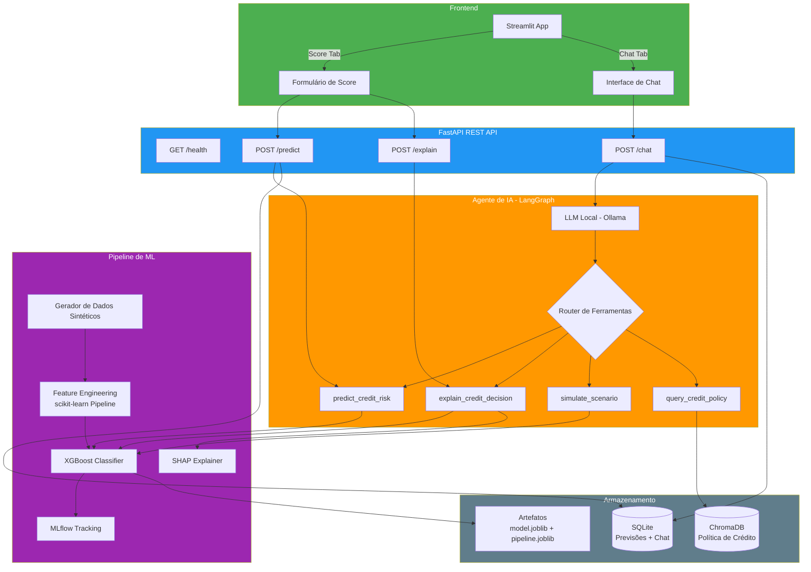
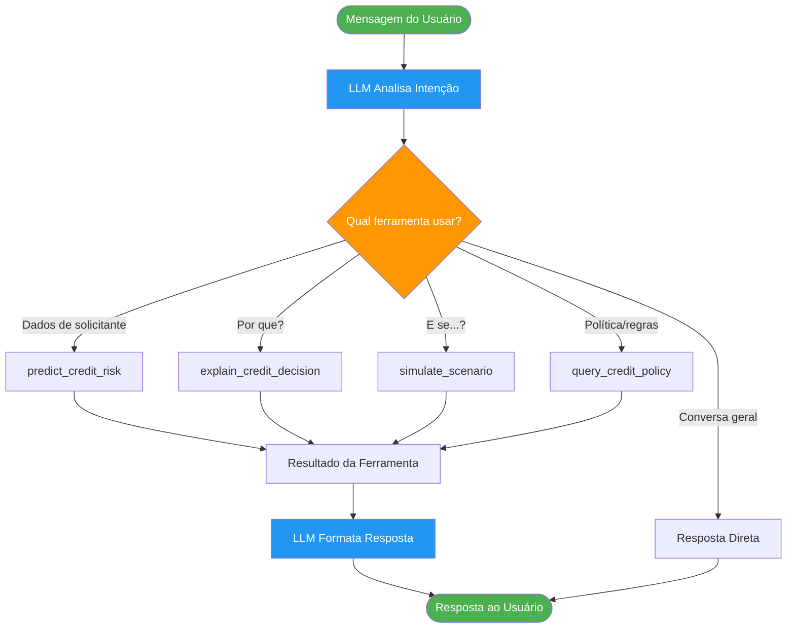
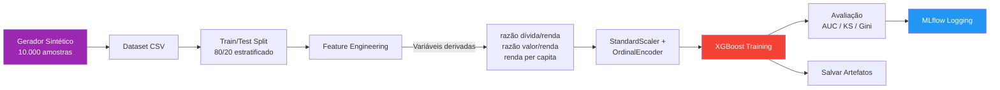

# Arquitetura do Sistema

## Visão Geral

Este sistema combina um modelo de Machine Learning para risco de crédito com um agente de IA conversacional que utiliza ferramentas (function calling) para tomar decisões autônomas.

## Diagrama de Arquitetura

## Fluxo de Decisão do Agente

## Fluxo de Dados do Pipeline de ML

## Componentes

| Componente | Tecnologia | Responsabilidade |
|---|---|---|
| Frontend | Streamlit | Dashboard de score + Chat |
| API | FastAPI + Uvicorn | Endpoints REST |
| Agente | LangGraph + Ollama | Orquestração de ferramentas via LLM |
| Modelo | XGBoost + scikit-learn | Previsão de inadimplência |
| Explicabilidade | SHAP | Interpretação por previsão |
| RAG | ChromaDB + sentence-transformers | Consulta à política de crédito |
| Banco de Dados | SQLite + SQLAlchemy | Persistência de previsões e chat |
| Tracking | MLflow | Métricas e artefatos de experimento |
| Containerização | Docker + docker-compose | Deploy completo |
